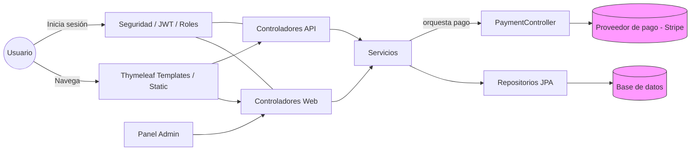

# Wildcards - Flujo de la aplicación

Resumen
-------
Pequeña explicación del flujo general de la aplicación Wildcards (Spring Boot + Thymeleaf).

Flujo general
-------------
- Usuario ↔ Interfaz: el usuario navega por páginas Thymeleaf y activos estáticos (css/js/img) para ver productos, autenticarse y gestionar el carrito.
- Controladores web: las rutas en `controllers.web` sirven vistas y delegan la lógica a los servicios.
- API y servicios: los controladores en `controllers.api` exponen endpoints REST (productos, carrito, pedidos, pagos) y usan los servicios (`services`) que contienen la lógica de negocio.
- Persistencia: los servicios usan repositorios JPA (`repositories`) para leer/escribir entidades (`models`) en la base de datos.
- Seguridad: el paquete `security` gestiona usuarios, roles y JWT/sesiones, restringiendo accesos (admin vs usuario).

Flujo de compra (resumen)
-------------------------
1. El usuario añade artículos al carrito (controlador web/API → `CarritoService` → repositorio).
2. Revisa el carrito y crea un pedido (`PedidoService`) que persiste `Pedido` y `PedidoItem`.
3. Para el pago, `PaymentController` integra con Stripe (u otro proveedor) para procesar la transacción.
4. Tras pago exitoso, se actualiza el estado del pedido y se notifica al usuario.

Diagrama (Mermaid)
------------------
Para visualizar este diagrama, abre el archivo en VSCode con una extensión Mermaid o en GitHub:



Notas
-----
- Los controladores web sirven las páginas Thymeleaf y solo delegan la lógica principal a los servicios.
- Los controladores API ofrecen endpoints JSON para operaciones asíncronas (ej. llamadas desde JS del frontend).
- El servicio de almacenamiento (`FileSystemStorageService`) gestiona ficheros subidos si los hay (imágenes, etc.).

Despliegue con Docker
---------------------
Se han añadido `Dockerfile`, `.dockerignore` y `docker-compose.yml` para facilitar el despliegue local.

- Levantar con Docker Compose (recomendado):

```bash
docker-compose up --build -d
```

Esto construye la imagen de la aplicación y arranca también un contenedor MySQL configurado con:

- Base de datos: `wildcards`
- Usuario: `wildcards`
- Contraseña: `wildcards` (cambia esto en producción)

- Alternativa (con build local del JAR):

```bash
# Windows PowerShell
.\mvnw.cmd package
docker build -t wildcards:latest .
docker run -p 8080:8080 \
  -e SPRING_DATASOURCE_URL=jdbc:mysql://<DB_HOST>:3306/wildcards \
  -e SPRING_DATASOURCE_USERNAME=wildcards \
  -e SPRING_DATASOURCE_PASSWORD=wildcards \
  wildcards:latest
```

Puntos importantes:

- `depends_on` en Compose no garantiza que MySQL esté listo; la aplicación puede intentar conectar antes de tiempo. Para mayor fiabilidad considera añadir un `healthcheck` para MySQL o usar un script de espera (`wait-for-it`, `dockerize`, o retry) antes de iniciar la app.
- No incluyas secretos en `application.properties` para producción (ej. `stripe.key.secret`, `jwt.secret`). Pásalos como variables de entorno o Docker secrets.
- Ajusta `MYSQL_ROOT_PASSWORD` en `docker-compose.yml` por una contraseña segura antes de usar en entornos no locales.
- Si la app escucha en otro puerto, actualiza el `EXPOSE` o el mapeo de puertos en Compose.


